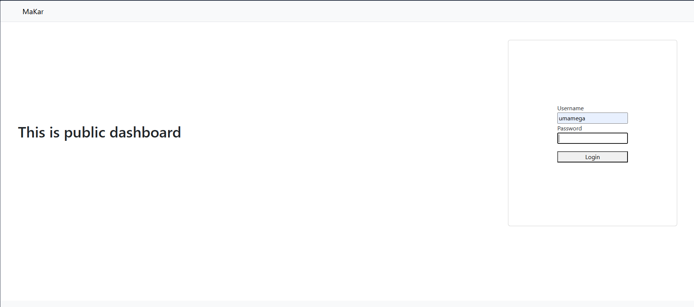
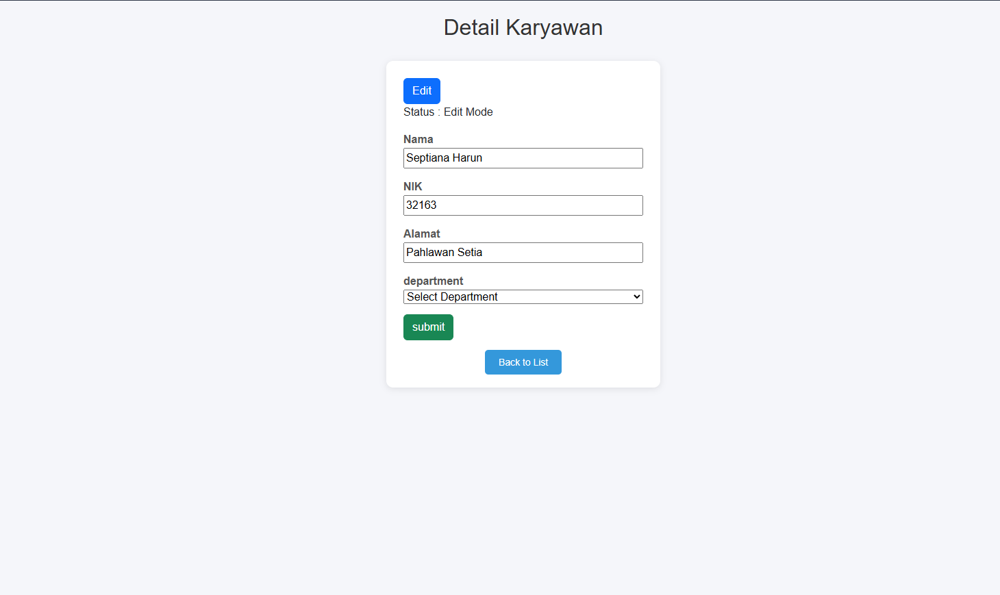
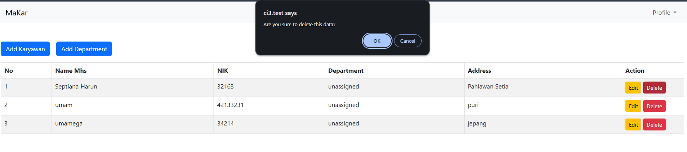
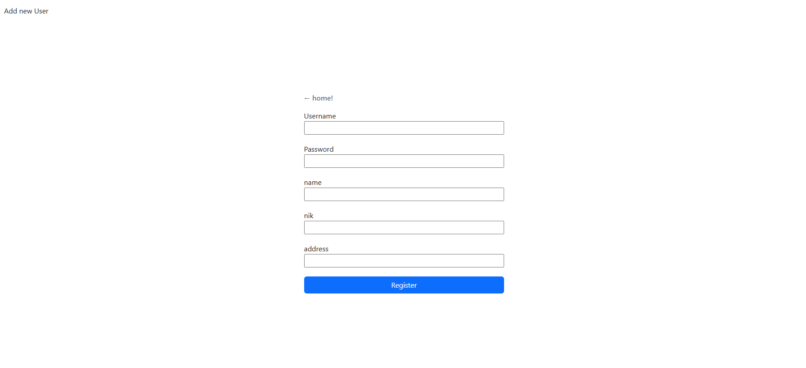
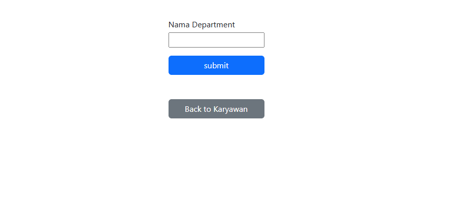
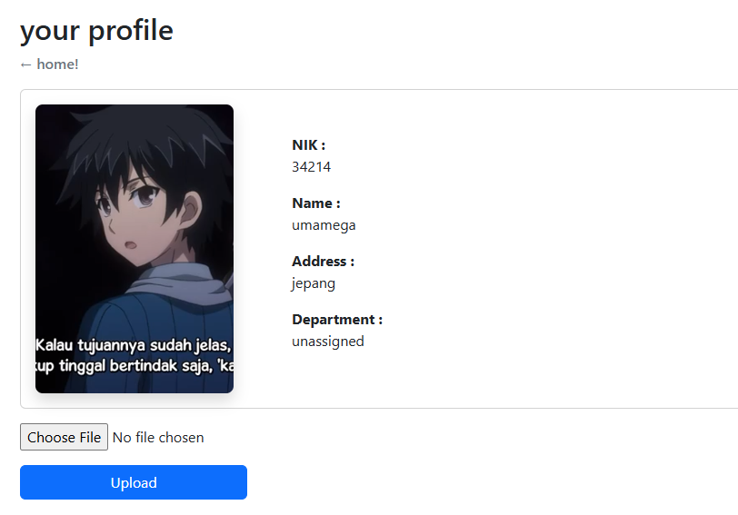
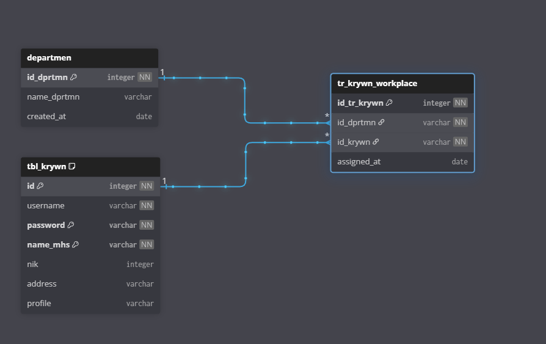

<!-- Title -->

 
    
 crud-makar-ci3 

    
 Manajemen Karyawan 

    <a href="https://github.com/rafifadhlu/crud-makar-ci3"> see full project</a>
    &middot;
    <a href="mailto:rafifadhlu14@gmail.com"> ask me</a>

# About Project
>This project initially for learning purpose. get to know the Codeigniter framework of PHP Languange. In this project i use Codeigniter 3 regarding my current workplace tech stack.
  

### Built With

## Feature
Because this is only basic CRUD for learning purpose, the features is limited only for one Role, no level permission, different routes, and etc. This project implemented the `routes`,`model`,`view`,`controller`and `media upload`, and etc.

The features are :
  
1. Login with basic auth session
  
 

2. Edit data 
  
 

3. Delete data 
  

3. add karyawan data 
  

4. add department data 
  

5. Upload profile picture 
  

<!-- DB Desing -->

## DB Design
The db design is so simple. i think it is the simplest db if we compare to others. DB only contains `3 Tables` and `1 Table Views`. This is the DB Design

  

<!-- LICENSE -->
## License

Distributed under the project_license. See `LICENSE.txt` for more information.
